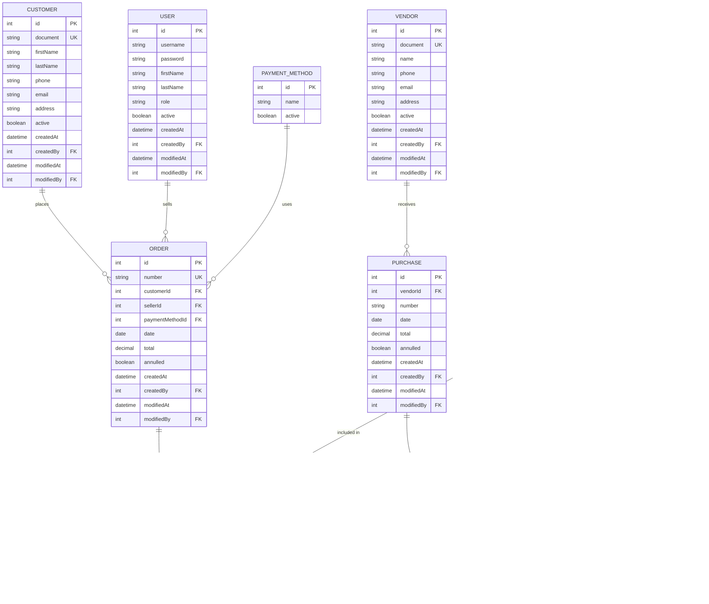

# Documento de Modelo de Dominio y Decisiones de Diseño

**Proyecto:** Sistema de Gestión para Distribuidora de Bebidas  
**Tipo de proyecto:** Trabajo Práctico Final – Tecnicatura en Programación  
**Versión:** 1.1

---

## 1. Objetivo del documento

El presente documento tiene como objetivo presentar el diseño de la base de datos del sistema y definir los módulos funcionales que serán desarrollados en el repositorio del proyecto.

Se presenta el esquema relacional de la base de datos, junto con una síntesis de las principales entidades, relaciones y decisiones de diseño adoptadas para su implementación mediante Entity Framework Core y MySQL.

Asimismo, se detallan los módulos que componen el sistema y las principales funcionalidades contempladas dentro del alcance del Trabajo Práctico Final, manteniendo un modelo simple, consistente y viable de implementar dentro de los plazos disponibles.

---

## 2. Diseño de la base de datos

### 2.1 Esquema relacional de la base de datos

La base de datos del sistema utiliza un modelo relacional implementado en MySQL. El esquema fue diseñado a partir del modelo de dominio definido para el proyecto y contempla las entidades necesarias para gestionar usuarios, productos, clientes, proveedores, compras, ventas, stock y sus correspondientes relaciones.

El siguiente Modelo Entidad-Relación (MER) presenta la estructura de la base de datos, incluyendo las principales entidades, atributos, claves y relaciones definidas para el sistema.

> **MER:** 



### 2.2 Entidades principales

El sistema estará compuesto por tres grandes grupos de entidades:

**Seguridad**
- User

**Entidades maestras**
- Product
- Category
- Brand
- Customer
- Vendor
- PaymentMethod

**Entidades operativas**
- Purchase
- PurchaseDetail
- Order
- OrderDetail
- StockMovement

### 2.2.1 User

Representa a los usuarios que utilizan el sistema.

```text
User
────────────────────────
id
name
email
password
role
active
createdAt
createdBy
```

El sistema tendrá inicialmente dos roles:

- `ADMIN`
- `SELLER`

El rol será representado mediante un enum y no mediante una entidad independiente.

El usuario administrador tendrá acceso a todos los módulos. El vendedor tendrá acceso principalmente a la gestión de su cartera de clientes y al registro de ventas.

El usuario inicial será creado mediante un script de base de datos.

El campo `createdBy` se mantendrá como dato de auditoría, pero no se establecerá una relación FK recursiva sobre `User`.

### 2.2.2 Product

Representa los artículos comercializados por la distribuidora.

```text
Product
────────────────────────
id
code
barcode
description
categoryId
brandId
purchasePrice
salePrice
stock
minimumStock
active
createdAt
createdBy
```

El `code` será ingresado manualmente por el usuario y deberá ser único.

El código de barras será opcional y editable.

Cada producto pertenece obligatoriamente a una categoría y a una marca.

El producto almacenará:

- precio de compra actual;
- precio de venta actual;
- stock actual;
- stock mínimo.

El stock actual se almacenará directamente en el registro del artículo y no será calculado recorriendo el historial de movimientos.

No se manejarán imágenes ni unidades de medida dentro del MVP.

### 2.2.3 Category

Representa las categorías de artículos.

```text
Category
────────────────────────
id
name
createdAt
createdBy
modifiedAt
modifiedBy
```

El nombre será obligatorio y único.

Las categorías no tendrán baja física. En caso de que posteriormente se requiera ocultar una categoría, se podrá contemplar un mecanismo de baja lógica.

### 2.2.4 Brand

Representa las marcas de los artículos.

```text
Brand
────────────────────────
id
name
createdAt
createdBy
modifiedAt
modifiedBy
```

El nombre será obligatorio y único.

Al igual que las categorías, no se contempla la eliminación física de una marca.

### 2.2.5 Customer

Representa a los clientes de la distribuidora.

```text
Customer
────────────────────────
id
name
document
phone
email
address
city
observations
active
createdAt
createdBy
modifiedAt
modifiedBy
```

El documento será obligatorio y único.

La dirección se manejará como texto libre y no se creará una entidad independiente para representar domicilios.

No se incluirán en el MVP:

- CUIT.
- Condición de IVA.
- Cuenta corriente.
- Límite de crédito.
- Lista de precios.
- Descuentos.
- Vendedor asignado al cliente.

El cliente podrá ser dado de alta desde el módulo de ventas utilizando el mismo formulario utilizado por el ABM de clientes.

### 2.2.6 Vendor

Representa a los proveedores de la distribuidora.

```text
Vendor
────────────────────────
id
name
phone
email
address
city
observations
active
createdAt
createdBy
modifiedAt
modifiedBy
```

El modelo será deliberadamente sencillo.

No se incluirán:

- CUIT.
- Condición de IVA.
- Datos fiscales.
- Cuenta corriente.
- Información bancaria.

No existirá una relación directa entre `Vendor` y `Product`.

Un mismo producto puede adquirirse a diferentes proveedores. La relación entre ambos quedará determinada por las operaciones de compra.

### 2.2.7 PaymentMethod

Representa los medios de pago utilizados en las ventas.

```text
PaymentMethod
────────────────────────
id
name
active
createdAt
createdBy
modifiedAt
modifiedBy
```

Los medios de pago se almacenarán en una tabla y no en un enum, debido a que pueden surgir nuevos medios de pago sin necesidad de modificar y recompilar la aplicación.

Sin embargo, no se desarrollará un ABM para esta entidad dentro del MVP. Los valores iniciales serán cargados mediante datos iniciales.

Cada venta tendrá un único medio de pago.

### 2.2.8 Purchase

Representa una operación de ingreso de mercadería.

```text
Purchase
────────────────────────
id
number
vendorId
date
total
observations
cancelled
createdAt
createdBy
modifiedAt
modifiedBy
```

Una compra pertenece a un único proveedor.

La operación deberá contener al menos un `PurchaseDetail` para poder ser confirmada.

La compra no podrá modificarse una vez confirmada.

En caso de error, deberá ser anulada. La anulación producirá los ajustes correspondientes sobre el stock.

No se utilizará un campo `status`, ya que no existen estados intermedios de compra dentro del alcance del MVP.

El número de compra será independiente del `id` técnico de la entidad.

### 2.2.9 PurchaseDetail

Representa cada artículo incluido en una compra.

```text
PurchaseDetail
────────────────────────
id
purchaseId
productId
quantity
purchasePrice
subtotal
```

Un mismo producto no podrá repetirse dentro de una misma compra.

Se establecerá una restricción lógica:

```text
UNIQUE(purchaseId, productId)
```

El `purchasePrice` será ingresado por el usuario al momento de registrar la operación.

Este precio:

1. Se almacenará en el detalle como valor histórico.
2. Actualizará el `purchasePrice` actual del producto.

El `subtotal` será calculado por el backend:

```text
quantity × purchasePrice
```

El frontend podrá mostrar este cálculo de manera informativa mientras se carga la operación, pero el usuario no podrá modificarlo.

El backend será responsable de realizar el cálculo definitivo y persistirlo.

### 2.2.10 Order

`Order` representa una venta confirmada.

No se manejará una entidad independiente denominada `Sale`.

Tampoco existirán pedidos pendientes dentro del modelo actual.

```text
Order
────────────────────────
id
number
customerId
sellerId
paymentMethodId
date
total
observations
cancelled
createdAt
createdBy
modifiedAt
modifiedBy
```

Una venta tendrá:

- un cliente;
- un vendedor;
- un medio de pago;
- al menos un detalle.

El administrador podrá acceder al módulo de ventas de acuerdo con las reglas de autorización definidas para el sistema.

#### Vendedor y usuario creador

`Order` tendrá dos referencias conceptualmente diferentes hacia `User`:

- `sellerId`: identifica al vendedor al que se atribuye la venta.
- `createdBy`: identifica al usuario que registró la operación.

Esto permite, por ejemplo, que un administrador registre una venta correspondiente a un vendedor.

### 2.2.10.1 Numeración de Order

El `number` será independiente del `id`.

El número será un valor entero y se mostrará al usuario con ocho dígitos mediante padding.

Por ejemplo:

```text
42 → 00000042
```

Los ceros no se almacenarán en la base de datos.

El próximo número se determinará tomando el máximo número existente y sumando uno.

### 2.2.11 OrderDetail

Representa cada artículo incluido en una venta.

```text
OrderDetail
────────────────────────
id
orderId
productId
quantity
salePrice
purchasePrice
subtotal
```

Un producto no podrá aparecer más de una vez dentro de una misma venta.

Se establecerá:

```text
UNIQUE(orderId, productId)
```

#### Precios históricos

El detalle almacenará tanto:

- `salePrice`: precio de venta al momento de la operación.
- `purchasePrice`: precio de compra vigente al momento de la operación.

Esto permite calcular posteriormente la ganancia histórica de la operación sin depender de los precios actuales del producto.

Por ejemplo:

```text
salePrice = 1800
purchasePrice = 1200
quantity = 10
```

La ganancia de la línea podrá determinarse mediante:

```text
(salePrice - purchasePrice) × quantity
```

El `subtotal` será calculado por el backend:

```text
quantity × salePrice
```

El frontend podrá mostrar el cálculo de manera informativa.

### 2.2.12 Stock

#### 2.2.12.1 Stock actual

El stock actual será almacenado directamente en:

```text
Product.stock
```

No se calculará recorriendo todos los movimientos históricos.

Cuando una operación modifique el stock, el backend deberá actualizar el stock del producto y registrar el movimiento correspondiente dentro de una misma transacción.

#### 2.2.12.2 StockMovement

Representa el historial de modificaciones del stock.

```text
StockMovement
────────────────────────
id
productId
type
quantity
referenceId
createdAt
createdBy
modifiedAt
modifiedBy
```

El campo `quantity` siempre almacenará valores positivos.

El efecto sobre el stock será determinado por el tipo de movimiento.

Los tipos serán:

- `PURCHASE`
- `SALE`
- `PURCHASE_CANCELLATION`
- `SALE_CANCELLATION`

| Tipo | Efecto |
|---|---:|
| `PURCHASE` | + stock |
| `SALE` | - stock |
| `PURCHASE_CANCELLATION` | - stock |
| `SALE_CANCELLATION` | + stock |

`referenceId` permitirá identificar la operación que originó el movimiento.

Dependiendo del tipo, podrá corresponder a una `Purchase` o a una `Order`.

No se establecerá una FK tradicional para `referenceId`, debido a que puede referenciar diferentes tipos de operación.

---

## 3. Relaciones principales

Las relaciones principales del dominio son:

```text
Category       1 ───── N Product
Brand          1 ───── N Product
Vendor         1 ───── N Purchase
Purchase       1 ───── N PurchaseDetail
Product        1 ───── N PurchaseDetail
Customer       1 ───── N Order
User           1 ───── N Order
PaymentMethod  1 ───── N Order
Order          1 ───── N OrderDetail
Product        1 ───── N OrderDetail
Product        1 ───── N StockMovement
```

Los campos `createdBy` forman parte de la auditoría de las entidades, pero no se considerarán relaciones de dominio en el modelo conceptual.

---

## 4. Módulos a desarrollar

El sistema se organizará en módulos funcionales que agrupan las principales operaciones necesarias para la gestión de la distribuidora. La definición de estos módulos busca representar las funcionalidades del sistema desde una perspectiva funcional, sin establecer una correspondencia directa entre cada módulo y una única entidad de la base de datos.

Los módulos contemplan tanto la administración de los datos maestros como el registro y seguimiento de las operaciones de compra y venta, la gestión del stock y la consulta de información para el seguimiento de la actividad del negocio.

### 4.1 Gestión de usuarios

Este módulo comprende la administración de los usuarios que operan el sistema.

Las principales funcionalidades previstas son:

- Registro de nuevos usuarios.
- Consulta y modificación de los datos de los usuarios.
- Baja lógica de usuarios.
- Identificación del usuario responsable de las operaciones realizadas, utilizada para la auditoría del sistema.

El módulo contempla la gestión de los datos necesarios para identificar a cada usuario y su participación en las operaciones registradas.

### 4.2 Gestión de productos

Este módulo comprende la administración de los productos comercializados por la distribuidora, junto con los datos utilizados para su clasificación.

Las principales funcionalidades previstas son:

- Registro y modificación de productos.
- Consulta de productos y sus datos comerciales.
- Gestión de categorías y marcas.
- Consulta de productos activos.
- Administración de los valores de compra y venta.
- Gestión de los datos relacionados con el stock y el stock mínimo.

Las categorías y marcas forman parte de la gestión de productos y permiten organizar y clasificar los artículos comercializados.

### 4.3 Gestión de clientes

Este módulo comprende el registro y administración de los clientes de la distribuidora.

Las principales funcionalidades previstas son:

- Registro de clientes.
- Consulta y modificación de sus datos.
- Baja lógica de clientes.
- Consulta de la información necesaria para asociar un cliente con las ventas realizadas.

La información registrada permitirá identificar al cliente y mantener la trazabilidad de las operaciones de venta asociadas.

### 4.4 Gestión de proveedores

Este módulo comprende el registro y administración de los proveedores con los que opera la distribuidora.

Las principales funcionalidades previstas son:

- Registro de proveedores.
- Consulta y modificación de sus datos.
- Baja lógica de proveedores.
- Consulta de la información necesaria para asociar un proveedor con las compras realizadas.

La información registrada permitirá identificar al proveedor y mantener la trazabilidad de las operaciones de compra asociadas.

### 4.5 Gestión de medios de pago

Este módulo comprende la administración de los medios de pago disponibles para registrar las ventas.

Las principales funcionalidades previstas son:

- Registro de medios de pago.
- Consulta y modificación de sus datos.
- Baja lógica de medios de pago.
- Asociación de un medio de pago a cada operación de venta.

La gestión se limita a identificar el medio utilizado en cada venta, sin contemplar procesos de integración con entidades financieras o plataformas de pago externas.

### 4.6 Gestión de compras

Este módulo comprende el registro y consulta de las compras realizadas a los proveedores.

Las principales funcionalidades previstas son:

- Registro de compras asociadas a un proveedor.
- Incorporación de uno o más productos mediante el detalle de la compra.
- Registro de cantidades y precios de compra.
- Cálculo y almacenamiento del total de la operación.
- Actualización del stock de los productos involucrados.
- Actualización del precio de compra de los productos cuando corresponda.
- Consulta de compras realizadas y sus respectivos detalles.
- Anulación de compras, contemplando la reversión de los movimientos de stock asociados.

Toda compra deberá contener al menos un detalle. El número de comprobante informado por el proveedor se conservará como parte de la operación y será único para cada proveedor.

### 4.7 Gestión de ventas

Este módulo comprende el registro y consulta de las ventas realizadas a los clientes.

Las principales funcionalidades previstas son:

- Registro de ventas asociadas a un cliente y a un vendedor.
- Incorporación de uno o más productos mediante el detalle de la venta.
- Registro de cantidades y precios de venta.
- Asociación de un medio de pago a la operación.
- Validación de la disponibilidad de stock antes de confirmar la venta.
- Actualización del stock de los productos vendidos.
- Consulta de ventas realizadas y sus respectivos detalles.
- Anulación de ventas, contemplando la reversión de los movimientos de stock asociados.

Toda venta deberá contener al menos un detalle. El precio de venta registrado en cada detalle corresponde al precio vigente al momento de confirmar la operación, permitiendo conservar el valor histórico de la venta independientemente de posteriores modificaciones en el precio del producto.

Las ventas se identifican mediante un número interno único y se gestionan mediante la entidad `Order`.

### 4.8 Gestión de stock

Este módulo comprende la consulta y el control de las existencias de los productos comercializados por la distribuidora.

Las principales funcionalidades previstas son:

- Consulta del stock actual de los productos.
- Identificación de productos cuyo stock se encuentre por debajo del nivel mínimo establecido.
- Registro y consulta de los movimientos que modifican el stock.
- Actualización de las existencias como consecuencia de las operaciones de compra, venta y sus correspondientes anulaciones.
- Conservación de la trazabilidad de los movimientos de stock.

El stock actual se mantiene asociado a cada producto, mientras que los movimientos permiten conservar el historial de las operaciones que produjeron modificaciones en las existencias.

### 4.9 Reportes y dashboard

Este módulo comprende la generación de información consolidada para el análisis y seguimiento de la actividad de la distribuidora.

Los reportes estarán orientados principalmente a la consulta de información administrativa y permitirán analizar las operaciones de ventas, compras y ganancias.

Entre las funcionalidades previstas se encuentran:

- Reporte de ventas, con información sobre total vendido, cantidad de comprobantes y cantidad de artículos vendidos, con filtros por rango de fechas.
- Reporte de compras, con información sobre total comprado y cantidad de operaciones, con filtros por rango de fechas.
- Reporte de ganancias, calculado utilizando los precios históricos registrados en los detalles de las ventas.
- Ventas por cliente, incluyendo cantidad de ventas e importe vendido.
- Ventas por vendedor, incluyendo cantidad de ventas e importe vendido.
- Productos más vendidos.
- Categorías más vendidas.
- Ganancias por categoría.

Además, el sistema contará con dashboards diferenciados según el perfil de usuario.

#### Dashboard Administrador

Permitirá visualizar indicadores generales de la operación, como:

- ventas del día;
- compras del día;
- ingresos del período;
- ganancia estimada;
- alertas de stock.

#### Dashboard Vendedor

Estará orientado exclusivamente a su actividad comercial y podrá mostrar:

- ventas del día;
- ventas del mes;
- cantidad de clientes de su cartera;
- productos más vendidos.

Este dashboard no expondrá información administrativa relacionada con compras, stock general ni indicadores globales de la distribuidora.

---

## 5. Reglas generales de integridad

### Operaciones

- `Purchase` y `Order` deben contener al menos un detalle.
- Una operación confirmada no puede ser modificada.
- Las operaciones pueden ser anuladas.
- Las anulaciones deben conservar el registro histórico de la operación.
- La anulación de una operación debe generar el movimiento inverso de stock correspondiente.

### Stock

- No se permite confirmar una venta por una cantidad superior al stock disponible.
- El frontend podrá informar al usuario sobre la disponibilidad de stock, pero el backend deberá realizar nuevamente la validación antes de confirmar la operación.
- La actualización del stock y el registro del movimiento correspondiente deberán realizarse de forma transaccional.
- `Product.stock` representa el stock actual del producto.
- No se contempla el ajuste manual de stock dentro del alcance del MVP.

### Precios

- El sistema utilizará una única lista de precios.
- `Product` mantiene el precio de compra y el precio de venta actuales.
- El precio de compra podrá actualizarse al registrar una compra.
- El precio de venta podrá ser modificado por el usuario cuando corresponda.
- El sistema podrá advertir cuando el precio de venta sea inferior al precio de compra.
- Las operaciones conservarán los precios utilizados al momento de su registro, independientemente de modificaciones posteriores en los precios del producto.

### Productos

- El código interno (`code`) debe ser único.
- El código de barras (`barcode`) es opcional y puede ser modificado.
- Cada producto debe estar asociado a una categoría y una marca.
- Los productos podrán desactivarse mediante baja lógica.

---

## 6. Bajas y conservación del historial

No se contempla la eliminación física de entidades que puedan estar relacionadas con operaciones históricas.

Las entidades maestras utilizarán baja lógica mediante el atributo `active`.

Las operaciones de compra y venta no serán eliminadas físicamente. En caso de requerir su anulación, se conservará el registro original y se indicará su condición de anulada mediante el mecanismo correspondiente.

Las anulaciones conservarán la información de la operación y sus detalles, y deberán generar los movimientos inversos de stock que correspondan.

El objetivo es conservar la trazabilidad de las operaciones y evitar que la eliminación de un registro afecte la información histórica.

---

## 7. Auditoría

Las entidades utilizarán dos campos de auditoría de creación y dos de actualización:

- `CreatedAt`: fecha y hora de creación del registro.
- `CreatedBy`: identificador del usuario que creó el registro.
- `ModifiedAt`: fecha y hora de la última modificación. Será opcional cuando el registro no haya sido modificado.
- `ModifiedBy`: identificador del usuario que realizó la última modificación. Será opcional cuando el registro no haya sido modificado.

La auditoría permitirá identificar cuándo y por quién fue creado y modificado cada registro.

Dentro del alcance del MVP no se contempla autenticación mediante JWT. Por este motivo, el identificador del usuario responsable de cada operación será informado por el cliente y utilizado por el backend para completar los campos de auditoría correspondientes.

---

## 8. Decisiones de diseño

A partir de los requerimientos del sistema y del alcance definido para el Trabajo Práctico Final, se establecen las siguientes decisiones de diseño:

### 1. Modelo de datos relacional

Se utilizará una base de datos relacional implementada en MySQL, debido a la naturaleza estructurada de la información y a las relaciones existentes entre las distintas entidades del sistema.

### 2. Tecnologías del backend

El backend será desarrollado en C# utilizando .NET y Entity Framework Core como tecnología de acceso y mapeo de datos.

### 3. Acceso a datos

Entity Framework Core utilizará `DbContext` como mecanismo principal de acceso a la base de datos.

### 4. Roles de usuario

El rol del usuario se representará mediante un enum, ya que los valores posibles forman parte de un conjunto cerrado definido por el sistema y no requieren una entidad independiente.

### 5. Medios de pago

Los medios de pago se representarán mediante una entidad propia, permitiendo administrar sus datos y asociarlos a las operaciones de venta.

No se contempla un ABM completo de medios de pago dentro del MVP.

### 6. Representación de las ventas

La entidad `Order` representa una venta confirmada. No se contempla una entidad `Sale` independiente ni el manejo de pedidos pendientes dentro del MVP.

### 7. Relación entre proveedores y productos

No se establecerá una relación directa entre `Vendor` y `Product`. La relación entre proveedores y productos se obtiene a través de las operaciones de compra registradas.

### 8. Gestión del stock

El stock actual se almacenará directamente en `Product`, mientras que `StockMovement` conservará el historial de los movimientos que modificaron dicho stock.

### 9. Precios históricos

Los precios utilizados en las operaciones se almacenarán en sus respectivos detalles (`PurchaseDetail` y `OrderDetail`), permitiendo conservar el valor histórico de cada operación independientemente de modificaciones posteriores en los precios del producto.

### 10. Bajas y anulaciones

Las entidades maestras utilizarán bajas lógicas, mientras que las operaciones de compra y venta podrán ser anuladas conservando su información histórica.

### 11. Comprobantes internos

El sistema no contempla la emisión de comprobantes fiscales. Los comprobantes generados tendrán carácter interno y podrán utilizarse como control de las operaciones de compra, venta, pedido o entrega.

### 12. Alcance administrativo y fiscal

El MVP no contempla integración con AFIP, cálculo de impuestos ni gestión de cuentas corrientes.

---

## 9. Alcance del MVP

El presente documento define el diseño de la base de datos y los módulos funcionales correspondientes al MVP del Trabajo Práctico Final.

El alcance contempla las funcionalidades necesarias para gestionar los principales procesos de la distribuidora, incluyendo:

- administración de productos, clientes, proveedores y usuarios;
- registro de compras y ventas;
- gestión y trazabilidad del stock;
- generación de reportes y dashboards para el seguimiento de la actividad.

Con el objetivo de mantener el proyecto técnicamente viable dentro de los plazos y objetivos establecidos para el Trabajo Práctico Final, se excluyen del alcance del MVP las funcionalidades que no resultan necesarias para cumplir con estos objetivos.

Entre las principales exclusiones se encuentran:

- Autenticación y autorización mediante JWT.
- Integración con AFIP y emisión de comprobantes fiscales.
- Cálculo y gestión de impuestos.
- Gestión de cuentas corrientes de clientes o proveedores.
- Múltiples listas de precios.
- Descuentos y promociones.
- Integraciones con plataformas o entidades financieras externas.
- Ajustes manuales de stock.
- Relación directa entre proveedores y productos.
- Gestión de pedidos pendientes de confirmación.

Las funcionalidades adicionales que puedan resultar necesarias en una implementación productiva podrán considerarse como futuras extensiones del sistema, pero no forman parte del alcance obligatorio del MVP salvo que sean requeridas posteriormente por el tutor.
